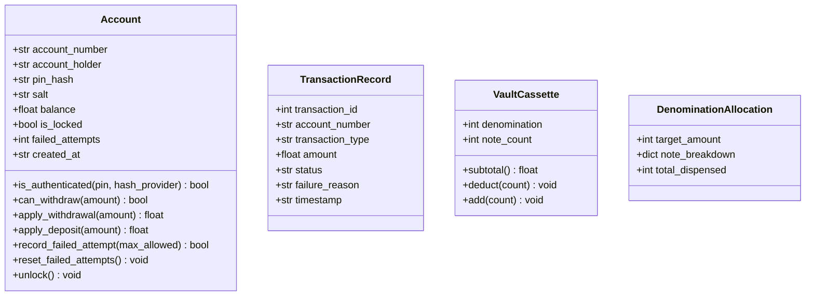

# 📊 System Design Analysis & SOLID Architecture Report
## Advanced Automated Teller Machine (ATM) Simulation System

---

## Executive Summary

This document presents a comprehensive **High-Level Design (HLD)**, **Low-Level Design (LLD)**, and **SOLID Principles Architectural Analysis** for the **Advanced ATM Simulator**. 

The objective of this design adaptation is to transform the procedural/semi-modular codebase into an institutional-grade, **Object-Oriented Architecture** built upon:
- **Clean Architecture & Layered Domain-Driven Design (DDD)**
- **SOLID Design Principles** (SRP, OCP, LSP, ISP, DIP)
- **Object-Oriented Paradigms** (Strict Encapsulation, Interface Abstraction, Polymorphism)
- **ACID-Compliant Concurrency Management** (`BEGIN IMMEDIATE TRANSACTION` write locks in SQLite3)
- **Defense-in-Depth Security** (PBKDF2-HMAC-SHA256 with 100,000 iterations, unique salts, server-side pepper secrets, constant-time verification, and brute-force lockout policies).

---

## 1. SOLID Principles Evaluation & Adaptation Matrix

| Principle | Initial Architectural State | Refactored Object-Oriented State |
| :--- | :--- | :--- |
| **S - Single Responsibility** | Functions in `core/transaction.py` performed database SQL queries, balance deductions, physical note dispensing, and audit logging within a single function scope. | Responsibility is strictly partitioned into: <br>• **Entities**: Pure domain models (`Account`, `VaultCassette`)<br>• **Repositories**: Data access and SQL mappings (`IAccountRepository`, `IVaultRepository`)<br>• **Services**: Business domain logic orchestration (`BankingTransactionService`, `VaultManagerService`)<br>• **Controllers/UI**: CLI Presentation layers (`CustomerAtmSession`, `BankManagerPortal`). |
| **O - Open/Closed** | Adding a new hashing algorithm or note allocation strategy required directly editing core functions with nested `if/else` checks. | Domain services rely on polymorphic strategy interfaces: <br>• `IHashProvider` allows swapping between PBKDF2, Argon2, or bcrypt without modifying authentication logic.<br>• `IDispenserStrategy` allows plugging in alternative note allocation algorithms (e.g. greedy, dynamic programming, backtracking) without modifying the vault service. |
| **L - Liskov Substitution** | Concrete SQLite functions were hard-bound to specific module calls, preventing substitution. | Any repository adhering to `IAccountRepository` or `ITransactionRepository` (e.g., `SqliteAccountRepository`, `InMemoryAccountRepository` for mock unit testing) can be substituted transparently with zero behavioral breakage. |
| **I - Interface Segregation** | Large, mixed functions exposed entire database operations to callers that only needed read operations. | Interfaces are broken down into focused, client-specific contracts: <br>• `IReadOnlyAccountRepository` (inquiry only)<br>• `IAccountModifierRepository` (balance update/locking)<br>• `ICashDispenser` (dispensing only)<br>• `ICashReceiver` (deposits only). |
| **D - Dependency Inversion** | High-level CLI controllers directly imported low-level database connection objects and executed raw SQL statements. | High-level controllers (`CustomerAtmSession`, `AdminPortal`) depend exclusively on abstract service interfaces (`IAuthenticationService`, `ITransactionService`, `IVaultManagerService`), which receive repository abstractions via Dependency Injection. |

---

## 2. High-Level Design (HLD) Architecture

```mermaid
graph TD
    subgraph Presentation Layer
        UI_Customer["Customer ATM Kiosk (main.py)"]
        UI_Admin["Bank Manager Portal (admin.py)"]
    end

    subgraph Service Layer (Business Logic)
        AuthService["AuthenticationService (core.services.auth)"]
        TxService["BankingTransactionService (core.services.tx)"]
        VaultService["VaultManagerService (core.services.vault)"]
        SecurityService["Pbkdf2PepperHashProvider (core.services.security)"]
    end

    subgraph Domain Model Layer (Entities)
        Account["Account Entity"]
        TxRecord["TransactionRecord Entity"]
        VaultCassette["VaultCassette Entity"]
    end

    subgraph Persistence Layer (Data Access)
        AccountRepo["SqliteAccountRepository"]
        TxRepo["SqliteTransactionRepository"]
        VaultRepo["SqliteVaultRepository"]
        DB[(SQLite3 Database atm.db)]
    end

    UI_Customer --> AuthService
    UI_Customer --> TxService
    UI_Admin --> AuthService
    UI_Admin --> TxService
    UI_Admin --> VaultService
    UI_Admin --> SecurityService

    AuthService --> SecurityService
    AuthService --> AccountRepo
    AuthService --> TxRepo
    TxService --> AccountRepo
    TxService --> TxRepo
    TxService --> VaultService
    VaultService --> VaultRepo

    AccountRepo --> DB
    TxRepo --> DB
    VaultRepo --> DB

    AccountRepo -.-> Account
    TxRepo -.-> TxRecord
    VaultRepo -.-> VaultCassette
```

---

## 3. Low-Level Design (LLD) Class Architecture

### 3.1 Domain Model Layer (`core.domain`)



---

### 3.2 Service & Interface Contracts (`core.interfaces`)

```mermaid
classDiagram
    class IHashProvider {
        <<interface>>
        +generate_salt() str
        +hash_pin(pin: str, salt: str) str
        +verify_pin(pin: str, salt: str, expected_hash: str) bool
    }

    class IAccountRepository {
        <<interface>>
        +get_by_number(account_number: str) Account
        +save(account: Account) void
        +create(account: Account) void
        +get_all() List~Account~
        +get_locked_accounts() List~Account~
    }

    class ITransactionRepository {
        <<interface>>
        +record_transaction(tx: TransactionRecord) int
        +get_recent_by_account(account_number: str, limit: int) List~TransactionRecord~
        +get_global_audit_logs(tx_type: str, limit: int) List~TransactionRecord~
    }

    class IVaultRepository {
        <<interface>>
        +get_inventory() Dict~int, int~
        +update_note_count(denomination: int, count: int) void
        +replenish_cassettes(refill: Dict~int, int~) void
    }

    class IAuthenticationService {
        <<interface>>
        +authenticate(account_number: str, pin: str) Account
        +unlock_account(account_number: str) bool
        +create_customer_account(holder: str, pin: str, initial_balance: float) Account
    }

    class ITransactionService {
        <<interface>>
        +check_balance(account_number: str) float
        +withdraw_cash(account_number: str, amount: float) Dict
        +deposit_cash(account_number: str, amount: float) Dict
        +get_statement(account_number: str, limit: int) List
        +change_security_pin(account_number: str, old_pin: str, new_pin: str) bool
    }

    class IVaultManagerService {
        <<interface>>
        +get_inventory() Dict~int, int~
        +get_total_cash() float
        +solve_dispense(amount: int) Dict~int, int~
        +replenish_vault(refill: Dict~int, int~) Dict~int, int~
    }
```



---

## 4. Cryptographic Security & Threat Modeling

1. **One-Way Key Derivation**: 
   $$\text{DerivedKey} = \text{PBKDF2-HMAC-SHA256}(\text{HMAC}_{\text{Pepper}}(\text{PIN}), \text{Salt}, \text{Iterations}=100,000)$$
2. **Server-Side Pepper Defense**:
   - Even if the SQLite database (`atm.db`) is dumped or compromised, attackers cannot brute-force PIN hashes offline without the server-side `ATM_SECURITY_PEPPER` secret environment variable.
3. **Timing-Safe Constant-Time Comparison**:
   - Digest equality checks utilize `secrets.compare_digest()` to eliminate side-channel timing analysis attacks.
4. **Immediate Lockout Policy**:
   - Counter increments atomically within a write-locked transaction; accounts lock immediately on the 3rd consecutive failed attempt.

---

## 5. Architectural Implementation Roadmap

1. **Domain Layer**: Create rich domain models in `core/domain/` (`Account`, `TransactionRecord`, `VaultCassette`).
2. **Abstract Interface Layer**: Define clean contracts in `core/interfaces/` for repositories, hash providers, and domain services.
3. **Repository Layer**: Implement relational database operations in `core/repositories/` (`SqliteAccountRepository`, `SqliteTransactionRepository`, `SqliteVaultRepository`).
4. **Service Layer**: Implement business logic orchestration in `core/services/` (`AuthenticationService`, `BankingTransactionService`, `VaultManagerService`, `Pbkdf2PepperHashProvider`).
5. **Presentation Layer Refactoring**:
   - `main.py`: Clean customer kiosk interface delegating entirely to domain services.
   - `admin.py`: Clean bank manager dashboard + **Cryptographic Hash & Security Inspector** for live demonstration.
6. **Documentation & Changelog**:
   - Maintain `CHANGES.md` across all 4 branches.
   - Update `README.md` reflecting pure open-source student development without commercial licensing badges.
